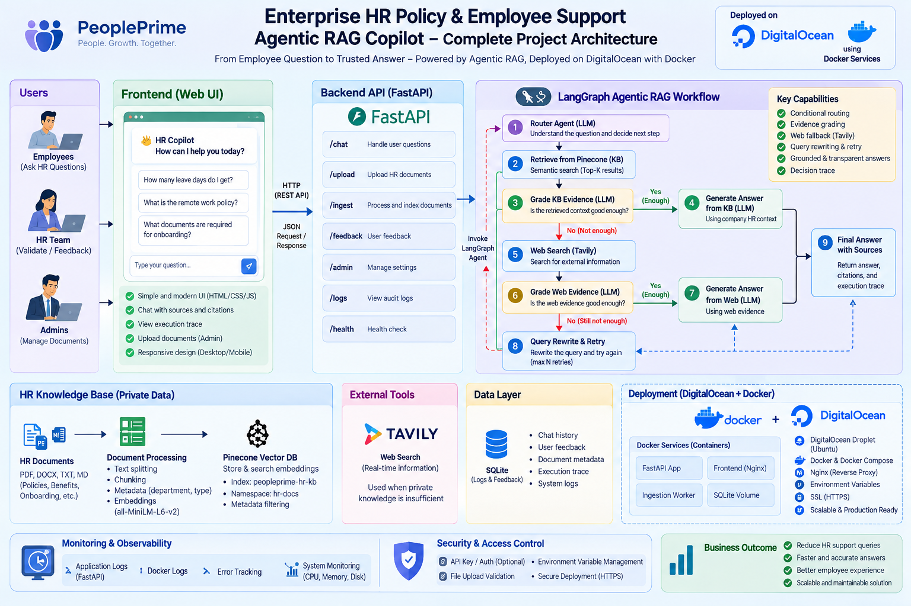

# Enterprise HR Policy & Employee Support Agentic RAG Copilot

An end-to-end Forward Deployed Engineer (FDE) project that converts an Agentic RAG workflow into a deployable internal HR product using LangGraph, FastAPI, Pinecone, OpenAI, Tavily, HTML, CSS, and JavaScript.

## 1. Business Problem

### Customer
NovaRetail, a fictional 3,000-employee retail company.

### Problem
The HR team maintains many internal documents: leave policies, remote-work rules, payroll guidance, benefits information, onboarding procedures, conduct policies, and HR operations runbooks.

Employees still send repetitive HR questions because they do not know where the correct policy lives, keyword search returns too many documents, generic chatbots may invent policy details, internal documents may not cover current public regulations, and some questions require fresh external information.

### Example
An employee asks:

> “How many annual leave days do employees receive?”

The answer exists in the private company HR knowledge base, so the system should answer from internal policy without searching the public internet.

Another employee asks:

> “What are the latest public holiday rules in Bangladesh?”

The internal KB may not contain current public information. The system should recognize weak private evidence, use external search, grade the evidence, and clearly identify the answer as external information requiring HR validation.

### Business Goal
Build a secure HR Policy Copilot that:

1. Searches trusted private HR knowledge first.
2. Checks whether retrieved evidence is sufficient.
3. Uses web search only when private knowledge is insufficient.
4. Rewrites weak queries and retries.
5. Generates grounded answers.
6. Shows the LangGraph decision path for transparency and debugging.
7. Lets authorized HR staff add new company documents.

## 2. Why This Is an FDE Project

A Forward Deployed Engineer does more than build an LLM notebook. The FDE translates a customer problem into a usable product:

```text
Customer Problem
      ↓
Discovery & Requirements
      ↓
Solution Architecture
      ↓
Data / Knowledge Integration
      ↓
Agentic RAG Development
      ↓
API Development
      ↓
User Interface
      ↓
Security + Audit + Testing
      ↓
Deployment
      ↓
Observe + Improve
```

## 3. Simple Architecture



```text
Employee / HR User
        ↓
HTML/CSS/JavaScript Web UI
        ↓ POST /api/chat
FastAPI
        ↓
LangGraph Agentic RAG Controller
        ↓
 ┌───────────────┬─────────────────┐
 ↓               ↓
Private HR KB    Tavily Web Search
Pinecone         (fallback only)
 └───────┬───────┘
         ↓
OpenAI LLM
Grounded Answer
```

## 4. Agentic RAG Workflow

```text
Question
   ↓
[1] Route Question
   ├── Greeting / simple chat ─────────→ Direct Answer
   │
   └── HR / policy question
                ↓
[2] Retrieve from Private Pinecone KB
                ↓
[3] Grade Private Evidence
       ┌────────┴────────┐
       │                 │
     GOOD               WEAK
       │                 │
       ▼                 ▼
Generate from KB   [4] Tavily Web Search
                         ↓
                  [5] Grade Web Evidence
                    ┌────┴─────┐
                    │          │
                  GOOD        WEAK
                    │          │
                    ▼          ▼
              Generate Web  [6] Rewrite Query
                               ↓
                         Retry Private KB
                               ↓
                        Max retry reached?
                               ↓
                    Insufficient Evidence
```

## 5. Technology Stack

| Layer | Technology | Purpose |
|---|---|---|
| Agent workflow | LangGraph | Stateful routing and conditional decisions |
| LLM | OpenAI | Routing, grading, rewriting, answer generation |
| Embeddings | OpenAI `text-embedding-3-small` | Vector embeddings |
| Vector DB | Pinecone | Private enterprise HR knowledge base |
| External search | Tavily | Fallback when company HR KB is insufficient |
| API | FastAPI | Backend and REST endpoints |
| Frontend | HTML/CSS/JavaScript | Employee-facing interface |
| Audit | SQLite | Decision-path logging |
| Packaging | Docker | Reproducible deployment |

## 6. Project Structure

```text
Enterprise-HR-Policy-Agentic-RAG-Copilot/
├── app/
│   ├── api/routes.py
│   ├── core/config.py
│   ├── core/logging.py
│   ├── rag/state.py
│   ├── rag/vectorstore.py
│   ├── rag/workflow.py
│   ├── services/audit.py
│   ├── services/ingestion.py
│   └── main.py
├── data/sample_kb/
│   ├── company_hr_handbook.md
│   └── hr_operations_runbook.md
├── static/
│   ├── css/style.css
│   └── js/app.js
├── templates/index.html
├── uploads/
├── Dockerfile
├── ingest_sample_kb.py
├── requirements.txt
├── run.py
└── README.md
```

## 7. Setup

### Step 1 — Create and activate a virtual environment

```bash
python -m venv venv
```

Windows:

```bash
venv\Scripts\activate
```

macOS/Linux:

```bash
source venv/bin/activate
```

### Step 2 — Install dependencies

```bash
pip install -r requirements.txt
```

### Step 3 — Configure environment

Copy `.env.example` to `.env` and add your keys.

```env
OPENAI_API_KEY=your_openai_api_key_here
TAVILY_API_KEY=your_tavily_api_key_here
PINECONE_API_KEY=your_pinecone_api_key_here
PINECONE_INDEX_NAME=fde-hr-policy-rag
PINECONE_NAMESPACE=company-hr-kb
OPENAI_MODEL=gpt-4o-mini
EMBEDDING_MODEL=text-embedding-3-small
ADMIN_API_KEY=change-me-in-production
APP_ENV=development
```

### Step 4 — Load sample HR knowledge

```bash
python ingest_sample_kb.py
```

### Step 5 — Run the application

```bash
python run.py
```

Open `http://127.0.0.1:8080` and FastAPI docs at `http://127.0.0.1:8080/docs`.

## 8. Classroom Demo Scenarios

### Demo A — Private KB Success
Ask: **How many annual leave days do employees receive?**

Expected path:

```text
Router → KB
Private KB Retrieval
KB Grade → GOOD
Generate from Private KB
```

### Demo B — Company Policy Question
Ask: **How many days per week can I work remotely?**

Expected result: answer from the internal HR handbook, without web search.

### Demo C — External / Current Information
Ask: **What are the latest public holiday rules in Bangladesh?**

Expected path when internal HR documents are insufficient:

```text
Router → KB
Private KB Retrieval
KB Grade → WEAK
Tavily Search
Web Grade → GOOD
Web Answer
```

### Demo D — Weak Query Rewrite
Ask an ambiguous HR question such as: **What happens if mine is wrong?**

If neither private nor web evidence is sufficient, the workflow can rewrite the query, retry the KB, and eventually stop with insufficient evidence rather than hallucinating.

## 9. What Changed From the IT Support Reference

The application structure, graph topology, API shape, retrieval logic, ingestion layer, audit layer, Docker setup, and frontend behavior remain the same. Only domain-specific elements were changed: HR prompts, HR configuration names, UI wording, example questions, sample documents, and documentation.
